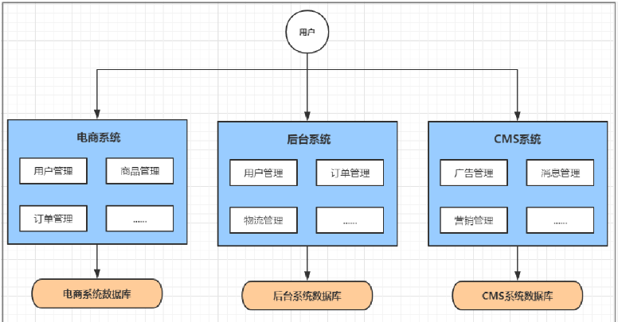
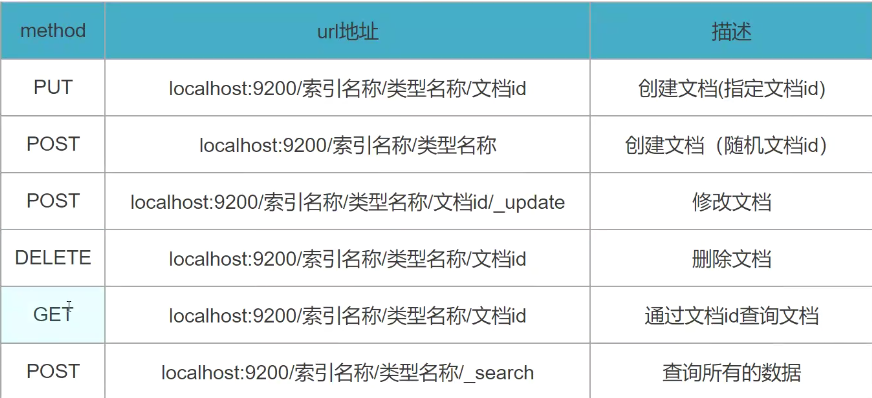

# 项目第一天

日期：2024-1-8

记录人：汲广熙

## 了解了git的工作流程


## 学习了如何操作Git做项目的版本控制

先在项目根目录下打开git bash 并运行以下命令来初始化Git仓库

`git init`

将项目中的文件添加到暂存区来进行版本控制 使用以下命令来添加

`git add`

使用以下命令来查看历史的版本

`git log`

使用以下命令将暂存区的项目文件提交到版本库中

`git commit -m "备注"`

## 如何创建仓库

在git Bash中使用git init进行初始化和创建仓库

在Idea中使用VNS中的create repository来创建仓库

也可以在gitee中手动创建一个仓库

## 学习如何使用Gitee做代码托管

要先将本地的项目在git -> gitee -> share project on gitee 中共享至远程仓库

在每次本地操作 git add, git commit后 使用以下命令会将本地库中的项目文件推送到远程仓库gitee中 从而实现代码托管

`git push`

## 如何从gitee平台上克隆项目

在gitee中打开项目仓库 点击克隆/下载 并且复制SSH的链接

在idea中新建一个Project from Version Control并将刚才所复制的代码粘贴到url中

点击clone idea就会自动执行git clone "SSH链接"

## 如何绑定邮箱和本地git的公钥

使用以下代码来绑定邮箱

`git config -l --global user.email '2870811759@qq.com'`

使用以下代码绑定邮箱并生成本地git的公钥

`ssh-keygen -t rsa -C "2870811759@qq.com"`

在gitee中个人设置的SSH公钥中使用本地生成的公钥进行绑定

# 项目第二天

日期：2024-1-9

记录人：汲广熙

## 回顾Git操作

```
1 git add . #添加全部修改
2 git pull #更新本地仓库
3 git commit -m "今天你干了啥"
4 git push #将今天的工作推送到码云
```

了解云创商城的需求分析以及整个项目的设计思路

软件系统架构发展路线

## 系统架构演变

```单体应用架构=>垂直应用架构=>分布式架构=>SOA架构=>微服务架构```

### 单体应用架构


将所有功能代码部署在一起

```
优点：项目架构简单 开发成本低 维护方便
缺点：不适用于大型项目 难于维护
```

### 垂直应用架构


将一个应用拆分为几个不同的应用 提高效率

```
优点：流量分担，解决并发问题；拆分系统，提高容错率
缺点：系统之间无法相互调用
```

### 分布式架构


分布式架构将应用分为两部分 服务层和展现层

```
优点：提高代码复用性
缺点：系统复杂 难以维护
```

### SOA架构


在分布式架构的基础上添加了一个服务注册中心 可以自动的去调节任务调度

```
优点：松耦合
缺点：容易出现雪崩
```

### 微服务架构


将应用程序模块化 拆分为多个模块

```
优点：服务原子化拆分 每个服务都有自己独立的功能
缺点：开发成本高
```

## 了解微服务常见的问题

```
如何管理
他们之间如何通讯
客户端如何访问
出现问题如何字处理
出现问题如何排错
```

经过本假期学习来深入探讨这些问题

## 微服务环境搭建

#### 创建基础模块以及实体类


```
在yunch_mall下新建模块shop-common 在pom.xml中 导入依赖项
创建pojo软件包添加三个实体类OrderTmp ProductTmp userTmp（用户表 订单表和商品表）
新建公共模块 用户模块 商品模块 订单模块
(xml配置文件文件中导入shop-common的公共依赖)
```

##### **在每个微服务模块中**

```
-yml配置文件
    --设置用户服务的端口
    --设置应用程序的名称
    --配置连接数据库
    --mybatis-plus配置
-添加启动类
    --用@SpringBootApplication标识为启动类
    调用SpringApplication.run()方法来启动SpringBoot应用程序
```

<br/>

# 项目第三天

日期：2024-1-10

记录人：汲广熙

### 完善各个模块

#### 创建实体类

```
在pojo包下创建***实体类
```

#### 创建mapper接口

```
在mapper包下创建***Mapper接口
实现MybatisPlus提供的BaseMapper实接口（现数据库操作的通用接口）
```

#### 创建service接口

```
在service包下创建***ServiceImpl接口
继承MybatisPlus提供的ServiceImpl类 这个类实现了Service接口
为用户提供了一些通用方法
```

#### 创建Controller类

```
在controller包下创建***Controller类
自动注入一个ProductServiceImpl的Bean
```

#### 为各个模块实现方法

```
在ProductController中实现detail方法（通过商品id返回商品的信息）
在OrderController中实现submitOrder方法（通过传入用户Id,商品Id,商品数量来提交一个订单）
    通过RestTemplate调用商品模块的detail方法（传入pid参数）并保存商品信息
    根据商品库存判断是否可以下订单
        库存不充足 -> 返回库存不足
        库存充足 -> 保存订单数据 返回订单部分信息 以及成功信息
```

#### 在订单服务的容器里注入一个RestTemplate的Bean

```
它能将http复杂的连接过程进行封装，使用它能方便的连接http客户端
```

## 服务治理

服务注册

服务发现

服务剔除


### 服务调用图


## 学习使用Nacos

### 搭建Nacos环境

```
在每个模块的xml配置文件中定义Nacos的发现配置
spring:
    cloud:
        nacos:
          discovery:
            server-addr: 127.0.0.1:8848
在每个模块的启动类中添加@EnableDiscoveryClient注解（开启服务注册和发现）
并在Nacos的注册服务中心中检查服务是否注册成功
```

# 项目第四天

日期：2024-1-11

记录人：汲广熙

#### RestTemplate

模板模式 封装建立http客户端 发起请求（过去式 分布式架构）

#### DiscoveryClient

Spring Cloud提供的可以保存需要调用的远程客户端的信息（从注册中心取到的）

### 将订单微服务注册到Nacos上

启动服务， 观察nacos的控制面板中是否有注册上来的订单微服务

```
// 指定服务名称（shop-product） 获取服务实例（ServiceInstance）
discoveryClient.getInstances() 
使用一个全局变量I 有效控制在索引区间 实现手动轮询(手动负载均衡)
```

## 负载均衡

将工作任务分摊到不同的服务单元（服务器）上


```
添加@LoadBalanced注解启用负载均衡
productServiceUrl = "http://" + "shop-product";
可以实现负载均衡并且Url直接使用http请求头+服务名称 更加简化开发过程 提高开发效率
```

### 负载均衡策略

#### 轮询策略

```
按顺序调用服务 例如有3个服务
第一次调用1 第二次调用2 第三次调用3 第四次调用1... 以此类推
```

#### 权重策略

```
根据响应时间的长短来分配权重 响应时间越长权重越小 被选中的可能性越低
每隔一段时间取收集所有服务的响应时间从而更新权重
```

#### 随机策略

```
随机的分配服务
```

#### 最小连接数策略

```
遍历所有服务 选取连接数最小的实例 （闲者多劳）
```

#### 重试策略

```
按照轮询来获取服务
如果获取失败 在指定时间内重试获取 如若超过时间则返回null
```

#### 可用敏感性策略

```
先过滤非健康的实例 在选取连接数较小的实例
```

#### 区域敏感策略

```
根据服务所在区域的性能可用性等来选择实例
```

## 基于Feign实现服务调用

```
创建ProductServiceClient和UserServiceClient接口模拟商品客户端和用户客户端
接口中实现对应客户端的方法
在接口中使用@FeignClient注解来指定需要调用的客户端
重新定义OrderController 使用@AutoWired依赖注入上面两个Bean
使用Feign客户端来完成远程调用服务
```

## 服务容错

### 服务容错三个核心思想

不被外界的环境影响<br/>
不被上游请求压垮 （控流）<br/>
不被下游响应拖垮 （熔断）<br/>

```
在商品模块中
将Controller中添加Thread.sleep(100); //让每次请求线程都睡眠0.1s
在yml配置文件中将Tomcat工作线程池的容量限制为10


压力测试 jMeter学习使用
添加线程组 添加取样器->http请求
```

### 服务雪崩


由一个服务产生的错误将上游请求的其他服务逐渐拖垮

#### 常见容错思路由隔离 超时 限流 熔断 降级

##### 隔离

```
服务相互隔离 一个模块内的错误不扩散到其他模块
```

##### 超时

```
调用服务时设置响应时间 超过这个时间 就断开请求 释放线程
```

##### 限流

```
设置一个请求的阈值 如果超过这个阈值 就拒绝服务 驳回请求
 从而保护下游请求不被压垮
```

##### 熔断

```
熔断：当下游请求响应过慢或无法响应 可以暂时切断对其调用
半熔断：发送试探性请求 查看下游服务是否恢复 若恢复则关闭熔断
```

##### 降级

```
就是提供一个备用方案 若无法调用服务 使用备用方案
```

#### 常见容错组件

Sentinel Hystrix resilience4j

# 项目第五天

日期：2024-1-12

记录人：汲广熙

## Sentinel入门

### 什么是Sentinel

```
用于服务容错的综合性解决行方案
从流量控制 熔断降级 系统负载保护等维度来保护系统稳定性
```

**_Sentinel底层实现机制：拦截器_**

### 集成Sentinel

```
添加 alibaba-sentinel依赖到公共模块的pom.xml中
在各个模块的yml配置文件中配置sentinel控制台地址以及和控制台通信的端口
```


### Sentinel的基本概念

```
资源 Sentinel要保护的东西
规则 用来定义如何保护资源
```

### 练习使用Sentinel进行流量控制 --

#### 新增流控规则

```
直接->指定接口达到限流阈值就开启限流
关联->当指定接口关联的接口达到阈值 指定接口就会被限流
链路->对指定接口的调用来源进行限流
```

#### 配置流控效果

```
快速失败 直接失败 抛出异常
Warm Up
排队等待 让请求匀速通过
```

### 熔断降级

当调用某个资源出现不稳定 可以对资源调用作出限制 避免影响其他服务 造成服务雪崩

#### 熔断策略

慢调用比例 异常比例 异常数

#### 热点规则

```
控制某个参数的流量
```

#### 授权规则

```
通过白名单和黑名单来限制资源是否通过
```

### Feign整合Sentinel

创建Fallback类实现服务客户端的接口

# 项目第六天

日期：2024-1-13

记录人：汲广熙

## 服务网关 Gateway

### 服务网关在架构中扮演什么角色？

### 底层是什么原理？

### 服务网关的功能

```
提供了一个统一的访问入口
在网关中实现了路由转发
鉴权：通过过滤器实现鉴权（是否有权限访问）
API网关就是系统的统一入口 实现一些与业务功能本身无关的公共逻辑 （认证 鉴权 监控 路由转发）
```

### Gateway的功能

```
Gateway为微服务架构提供了一种简单有效的统一的API路由管理方式 并且基于Filter链的方式提供了网关基本的功能 （安全 监控 限流）
优点： 性能强劲 功能强大 设计优雅，易于拓展
```

### 网关配置

```
新建api-gateway模块
导入gateway网关依赖
配置yml文件 定义服务的端口、名称等

初始版本：
  cloud:
    gateway:
      routes:
        - id: product_route
          uri: http://127.0.0.1:8071 #商品服务结点 需要直接指定Ip和端口 不易维护且无法实现负载均衡
          order: 1
          #http://localhost:7000/shop-product/product/1
          #基于路由规则和过滤器 路径发生如下变化
          #http://localhost:8081/product/1
          predicates:
            - Path=/shop-product/**
          filters:
            - StripPrefix=1
            
增强版本
  cloud:
    nacos:
      server-addr: localhost:8848
    gateway:
      routes:
        - id: product_route
          uri: lb://shop-product # 增强版的uri使用服务取替代ip:port 增加了负载均衡 lb(loadBalance)
          order: 1
          #http://localhost:7000/shop-product/product/1
          #基于路由规则和过滤器 路径发生如下变化
          #http://localhost:8081/product/1
          predicates:
            - Path=/shop-product/**
          filters:
            - StripPrefix=1
引用了nacos来进行服务发现

最终版本
cloud:
    nacos:
      server-addr: localhost:8848
    gateway:
      discovery:
        locator:
          enabled: true #启用gateway路由发现 （自动去Nacos注册中心去查找服务信息）
            
            
路由是gateway中最基本的组件之一
- id 路由唯一的标识符
- uri 路由的目标地址
- order  路由的优先级 数字越小优先级越高
-predicates 条件判断 
-filters  过滤器 
```

执行流程图


### 过滤器

过滤器是网关中提供的一种对请求和响应做处理的功能，使用过滤器可以修改请求的信息，并可以对响应进行修改。
生命周期： Pre Post
路由请求之前->pre
路由到微服务之后->post

### JWT

JWT的组成


JWT权限认证的流程图


```
首先第一步用户登录的时候，携带用户名和密码，然后网关会对这个登录请求跳过身份认证的环节。然后这个用户名和密码就会发给我们的权限服务。然后在权限服务当中拿着这个用户名和密码去数据库做认证。
如果认证通过了，那么就会生成一个token令牌，这个token令牌就是用JWT的标准生成的，token令牌就会被保存在客户端，然后之后客户端再访问我们这个微服务系统的时候，它就会携带这个token令牌
拿着这个token令牌还是去权限服务里做合法性校验。然后会返回是否合法的一个结果，如果认证通过了，那么就会执行具体的路由操作，否则返回一个401没有权限的错误。
```

在用户模块创建JwtUtil工具类 实现create和parse方法进行加密和解密

# 项目第七天

日期：2024-1-15

记录人：汲广熙

### 测试权限认证的过滤器

安装本地post测试工具


更新配置文件 解决前后端分离架构跨域访问的问题

### 网关限流

网管是所有请求的入口 所以可以对网关进行限流

导入Sentinel依赖
编写配置类GatewayConfiguration 配置基于Sentinel的Gateway限流

## SwaggerUI

SwaggerUI是一个API文档在线自动生成工具，它可以从代码中的注解自动生成API文档

```
导入Swagger依赖后
在Controller类中
使用@Api注解 添加在Controller类上 每个类加一次
使用@ApiOperation注解 加在请求处理方法上 每个方法加一次
使用@ApiParam注解 加在请求参数上 每个参数加一次
http://localhost:{对应模块的端口号}/doc.html
```

### code-generator

```
新建code-generator模块 test包下generator类生成entity
common模块下pojo包下新建每个模块的包 将生成对应的entity放入对应的包
新建shop-content和shop-sale模块 
将生成的controller service mapper导入对应的模块 
```

# 项目第八天

日期：2024-1-16

记录人：汲广熙

## Sleuth--链路追踪

如何***快***速发现问题？<br/>
如何判断故障影响***范围***？<br/>
如何梳理服务依赖以及依赖的***合理***性？<br/>
如何分析链路***性能***问题以及***实时容量规划***？


#### Sleuth

```
springCloud提供的分布式系统中链路追踪解决方案
span:  基本工作单元，一次链路调用创建一个span，并使用一个64位ID标识它
trace:  全局唯一，用来标识一条请求链路，一个traceId包含一个或多个span
annotation:  用来记录一段时间内的一个事件
```

#### zipkin

解决微服务架构中的延迟问题 包括：**_数据的收集、存储、查找和展现_**

### Nacos服务配置

微服务架构关于配置文件的常见问题

```
配置文件相对分散
配置文件无法区分环境
配置文件无法实时更新
```

使用配置中心来解决以上问题

加入配置中心后 系统架构图就会变为下面这样：


#### 配置动态刷新

方式一：硬编码方式<br/>
方式二：注解方式<br/>

```
@RestController
//方式二：自动刷新属性的值
@RefreshScope
public class ConfigTestController {

//    方式一：硬编码方式获取上下文环境中的属性最新值
    @Autowired
    private ConfigurableApplicationContext context;

    @Value("${author.name}")
    private String authorName;

    @RequestMapping("/configTest1")
    public String getAuthProperty() {
        return context.getEnvironment().getProperty("author.name");
    }

    @RequestMapping("/configTest2")
    public String getAuthorProperty2() {
        return authorName;
    }
}
```

# 项目第九天

日期：2024-1-17

记录人：汲广熙

安装配置Node.js

git clone yunchmall-admin-web 完成前端项目安装


```
切换成淘宝镜像源
npm config set registry https://registry.npm.taobao.org
安装项目
npm install
```

AdminServiceImpl类新建login方法
在IAdminServiceImpl中实现管理员的登录方法 并在Controller中实现对应的方法

### 当端口被占用时的解决方法


# 项目第十天

日期：2024-1-18

记录人：汲广熙

### 完善云创商城的部分功能

登录功能 退出登录 查询管理员列表 增、删、改管理员等

```
登录功能
通过前端请求路径代码在adminController中实现对应的方法
 post请求方法
请求参数为一个Admin的请求体参数 通过在adminService中定义的login方法、
在数据库中进行比对 如果比对成功返回JWT格式的token
将token保存在客户端的cookie中并在后续的请求中携带含有token的请求头
```

查询管理员列表

/*

1. 请求路径?a=1&b=2 @RequestParam
2. 请求路径/1/2 @PathVariable
3. POST请求，并且参数使用JSON格式封装 {"a":1, "b":2} @RequestBody
   */

# 项目第十一天

日期：2024-1-19

记录人：汲广熙

### 完善用户列表

#### 添加修改管理员状态方法

使用UpdateWrapper类构造更新方法<br/>
添加对应的查询条件<br/>
使用ResponseResult类中返回成功的响应码<br/>

```java
@ApiOperation(value = "修改管理员状态", httpMethod = "POST")
    @RequestMapping("/updateStatus/{id}")
    public ResponseResult updateStatus(@PathVariable("id") long id, @RequestParam("status") int status) {
        UpdateWrapper<Admin> updateWrapper = new UpdateWrapper<>();
        updateWrapper.eq("id", id);
        updateWrapper.set("status", status);
        adminService.update(updateWrapper);
        return new ResponseResult<>(200, "修改成功");
    }
```

添加修改管理员的角色方法

使用Transactional注解来完成在同一个事务中的操作<br/>
使用QueryWrapper类构造查询方法<br/>
添加对应的查询条件<br/>
将查询结果封装到ResponseResult类中并返回<br/>

```java
@Override
@Transactional //保证这个业务方法里的所有数据库操作都在同一个事务中完成
public void allocRole(long adminId, String roleIds) {
//        1.移除它原来的角色
        QueryWrapper queryWrapper = new QueryWrapper();
        queryWrapper.eq("admin_id", adminId);
//        delete from ums_admin_role_relation where admin_id = ?
        adminRoleRelationMapper.delete(queryWrapper);
//        2.分配当前全部角色
        if(!StringUtils.isEmpty(roleIds)) {
        for (String roleId : roleIds.split(",")) {
        AdminRoleRelation adminRoleRelation = new AdminRoleRelation();
        adminRoleRelation.setAdminId(adminId);
        adminRoleRelation.setRoleId(Long.valueOf(roleId));
        adminRoleRelationMapper.insert(adminRoleRelation); //将封装的relation对象添加到数据库表中
        }
        }
//        3.将1和2置于一个事务当中
        }
```

```
//fill = FieldFill.INSERT 表示在插入这条记录前这个属性的值会被自动填充
@TableField(fill = FieldFill.INSERT)
```

### 完善商品列表模块

#### 添加一个方法来查询商品列表

```
通过ApiOperation注解来在swagger里标记这个方法
定义一个url路径
使用QueryWrapper类来构造查询方法
通过逻辑判断来在queryWrapper里添加查询条件 
通过自定义得ResponseResult类返回查询数据和状态码
```

```java
    @ApiOperation("添加/删除商品（回收站）")
    @PostMapping("/update/deleteStatus")
    public ResponseResult updateDeleteStatus(@RequestParam @ApiParam("要修改的状态") int deleteStatus, @RequestParam @ApiParam("批量操作的Id") String ids) {
      UpdateWrapper<Product> updateWrapper = new UpdateWrapper<>();
      updateWrapper.set("delete_status", deleteStatus);
      updateWrapper.in("id", ids.split(","));
      productService.update(updateWrapper);
      return new ResponseResult<>(200, "修改成功");
    }
```

通过ApiOperation注解来在swagger里标记添加删除商品方法


# 项目第十二天

日期：2024-1-21

记录人：汲广熙

#### 完成上传文件功能
新建shop-oss模块 导入minio的配置类和配置文件 


# 项目第十三天

日期：2024-1-22

记录人：汲广熙

学习git创建分支
git branch 列出当前已有分支
git branch ** 创建分支
git checkout ** 切换分支
git checkout . 从暂存区回退到工作区
git checkout HEAD . 从版本库回退到工作区
git checkout -b tt 创建并切换分支
git merge ** 合并分支
git branch -d ** 删除分支
git branch -D ** 强制删除分支

# 项目第十四天

日期：2024-1-23

记录人：汲广熙

### 完善商品模块

# 项目第十五天

日期：2024-1-24

记录人：汲广熙

### 完善商品模块

# 项目第十六天

日期：2024-1-25

记录人：汲广熙

### 完善订单模块

#### 完成查询订单列表方法
```
通过ApiOperation注解来在swagger里标记这个方法
定义一个'/list'的url路径
将请求所需参数转换为方法参数
通过逻辑判断来在queryWrapper里添加查询条件
通过自定义得ResponseResult类返回查询数据和状态码
```

#### 完成查询单个订单信息
```
定义一个'/detail'的url路径
方法参数为order的id属性
通过mybatis plus提供的getbyid方法来查找订单数据
并通过id将订单商品和操作信息添加到order对象中
通过自定义得ResponseResult类返回查询数据和状态码
```

 Mybatis声明式的事务处理 事务交由Spring托管 面向切面编程 代码增强 环绕通知 

#### 完成关闭订单
```
在ServiceImpl中重写closeOrder方法
修改订单状态 执行批量更新
记录日志
释放库存
通过自定义的ResponseResult类返回查询数据和状态码
```

# 项目第十七天

日期：2024-1-26

记录人：汲广熙

### 完善订单模块

#### 完成删除订单方法
```
在ServiceImpl中实现remove方法
如果订单满足删除状态则将删除状态改为1
通过请求头中的token将操作历史插入数据库表中
```

#### 完成修改收件人方法
```
在ServiceImpl中实现updateReceiver方法
将前端请求中的参数存储到对象中进行后续操作
修改订单收件人信息 将对应的订单id中的收件人信息进行修改
通过请求头中的token将操作历史插入数据库表中
通过自定义的ResponseResult类返回查询数据和状态码
```

#### 完成修改订单费用
```
在ServiceImpl中实现moneyInfo方法
将前端请求中的参数存储到对象中进行后续操作
修改订单运费和后台的折扣金额

```

# 项目第十八天

日期：2024-1-27

记录人：汲广熙

## 学习Redis
```
将高频率访问的数据缓存到Redis 减少对数据库的频繁操作 提高系统性能
Redis是一个开源（BSD许可），内存存储的数据结构服务器，可用作数据库，高速缓存和消息队列代理。
它支持字符串、哈希表、列表、集合、有序集合，位图等数据类型。
（快，高速）
```
默认16数据库 下标从0开始、

###  扩容机制
```
字符串长度小于1M 每次扩容加一倍 大于1M时 每次扩容1M （节约空间）
redis字符串最大长度为512M
```

### Redis列表
单键多值 底层使用双向链表实现 

#### 数据结构
```
数据结构为快速链表quickList 双向指针
ziplist 压缩列表
压缩编码 在元素较少时使用一块连续的内存存储（一个节点 加快检索速度） (无法找到很大的一个连续空间)
将这些存储多个元素的节点组成一个链表 中和链表和数组 在保存较低空间开销时 加快了检索速度
```

### redis集合
set自动排重 想存储列表又不希望出现重复数据 set是一个很好的选择

#### 数据结构
set数据结构是字典 字典是hash表实现的

### redis哈希
键值对集合 string类型的key和value映射表

#### 数据结构
ziplist压缩列表 hashtable哈希表

### redis有序集合zset
为每个节点关联一个评分(score) 通过评分来排序

#### 数据结构
hash表

跳表


用docker拉取redis镜像

# 项目第十九天

日期：2024-1-29

记录人：汲广熙

#### 练习使用使用Spring框架中的RedisTemplate实例练习不同数据类型的操作
```
ValueOperations valueOperations = redisTemplate.opsForValue();
ListOperations listOperations = redisTemplate.opsForList();
SetOperations setOperations = redisTemplate.opsForSet();
ZSetOperations zSetOperations = redisTemplate.opsForZSet();
HashOperations hashOperations = redisTemplate.opsForHash();
```
## 在项目中使用redis缓存
在公共模块中加入data-redis依赖

nacos的公共配置文件中添加redis的配置信息

### 为什么不用mybatis本地缓存

**mybatis应用内本地缓存 多个服务之间无法共享**

**redis分布式缓存技术 高于应用 多个负载均衡的应用可以共享缓存**

菜单列表 登录token

使用Spring Cache进一步整合Redis
1. 添加cache的依赖
2. 在启动类前添加@EnableCaching注解
3. 在配置文件中设置Spring.cache.type=redis
4. 在需要缓存数据返回值数据的serviceImpl方法前添加@Cacheable
5. 通过设置cacheManager属性定义缓存的格式和时间
```
@Cacheable(value = "Role", key = "#root.methodName + '_' + #roleId", cacheManager = "cacheManager5Minute")
```

# 项目第二十天

日期：2024-1-30

记录人：汲广熙

## 学习使用ElasticSearch

在config/elasticsearch.yml中添加配置文件
```yaml
http.cors.enabled: true
http.cors.allow-origin: "*"
```

数据库 -> 表结构
redis -> 键值对
ES ->  索引(数据库) types(表) documents(行) fields(字段)

客户端操作
1. elasticsearch-head插件
2. 通过Restful接口直接访问
3. 使用提供的API进行访问


PUT创建文档(修改文档)
```mongodb-json
PUT /index_test2/_doc/1
{
  "name": "孙悟空",                                                    
  
  "age": 545
}
```
GET查看文档
```mongodb-json
GET /index_test2/_doc/1
}
```
POST修改部分文档
```mongodb-json
POST /index_test4/_doc/1/_update
{
  "doc": {
    "age": 20
  }
}
```
DELETE删除文档
```mongodb-json
DELETE /index_test1
```

新建elasticsearch模块 引入elasticsearch依赖

