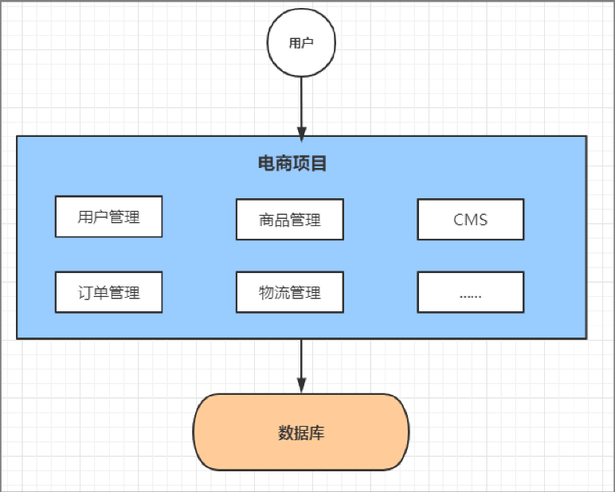

# 项目第一天
日期：2024-1-8

记录人：汲广熙

## 了解了git的工作流程


## 学习了如何操作Git做项目的版本控制

先在项目根目录下打开git bash 并运行以下命令来初始化Git仓库

`git init`

将项目中的文件添加到暂存区来进行版本控制 使用以下命令来添加

`git add`

使用以下命令来查看历史的版本

`git log`

使用以下命令将暂存区的项目文件提交到版本库中

`git commit -m "备注"`


## 如何创建仓库
在git Bash中使用git init进行初始化和创建仓库

在Idea中使用VNS中的create repository来创建仓库

也可以在gitee中手动创建一个仓库
## 学习如何使用Gitee做代码托管
要先将本地的项目在git -> gitee -> share project on gitee 中共享至远程仓库

在每次本地操作 git add, git commit后 使用以下命令会将本地库中的项目文件推送到远程仓库gitee中 从而实现代码托管

`git push`

## 如何从gitee平台上克隆项目
在gitee中打开项目仓库 点击克隆/下载 并且复制SSH的链接

在idea中新建一个Project from Version Control并将刚才所复制的代码粘贴到url中

点击clone idea就会自动执行git clone "SSH链接"
## 如何绑定邮箱和本地git的公钥
使用以下代码来绑定邮箱

`git config -l --global user.email '2870811759@qq.com'`

使用以下代码绑定邮箱并生成本地git的公钥

`ssh-keygen -t rsa -C "2870811759@qq.com"`

在gitee中个人设置的SSH公钥中使用本地生成的公钥进行绑定


# 项目第二天
日期：2024-1-8

记录人：汲广熙

了解云创商城的需求分析以及整个项目的设计思路

软件系统架构发展路线


## 系统架构演变

```单体应用架构=>垂直应用架构=>分布式架构=>SOA架构=>微服务架构```


### 单体应用架构

将所有功能代码部署在一起
```
优点：项目架构简单 开发成本低 维护方便
缺点：不适用于大型项目 难于维护
```


### 垂直应用架构

将一个应用拆分为几个不同的应用 提高效率
```
优点：流量分担，解决并发问题；拆分系统，提高容错率
缺点：系统之间无法相互调用
```


### 分布式架构

分布式架构将应用分为两部分 服务层和展现层
```
优点：提高代码复用性
缺点：系统复杂 难以维护
```


### SOA架构

```
缺点：容易出现雪崩
```


### 微服务架构

将应用程序模块化 拆分为多个模块
```
优点：服务原子化拆分 每个服务都有自己独立的功能
缺点：开发成本高
```


## 了解微服务常见的问题

```
如何管理
他们之间如何通讯
客户端如何访问
出现问题如何字处理
出现问题如何排错
```


## 微服务环境搭建

#### 创建基础模块以及实体类

```
在yunch_mall下新建模块shop-common 在pom.xml中 导入依赖项
创建pojo软件包添加三个实体类OrderTmp ProductTmp userTmp（用户表 订单表和商品表）
新建公共模块 用户模块 商品模块 订单模块
(xml配置文件文件中导入shop-common的公共依赖)
```
##### **在每个微服务模块中**
```
-yml配置文件
    --设置用户服务的端口
    --设置应用程序的名称
    --配置连接数据库
    --mybatis-plus配置
-添加启动类
    --用@SpringBootApplication标识为启动类
    调用SpringApplication.run()方法来启动SpringBoot应用程序
```

<br/>
111